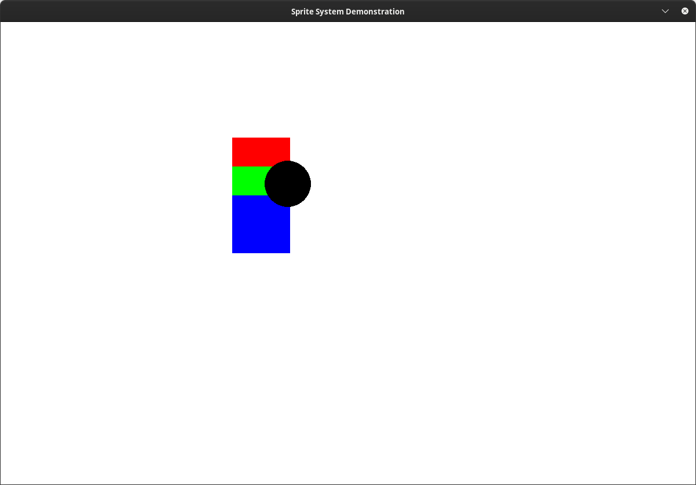
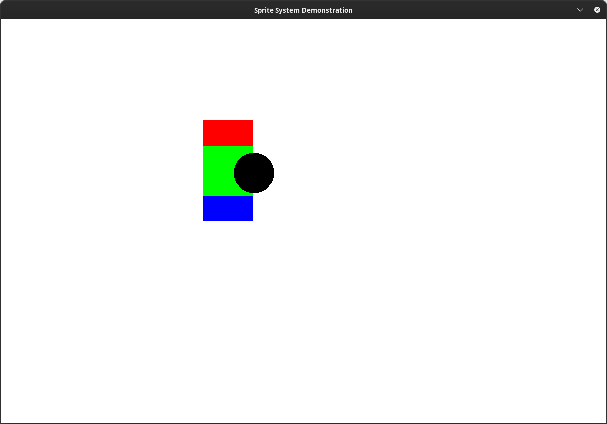
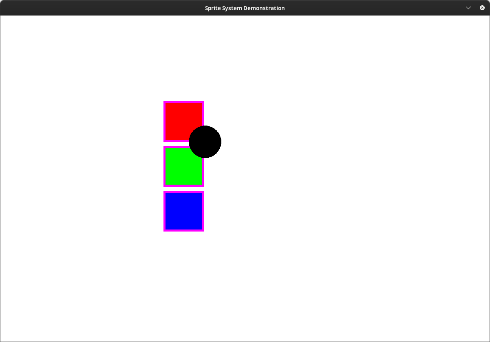
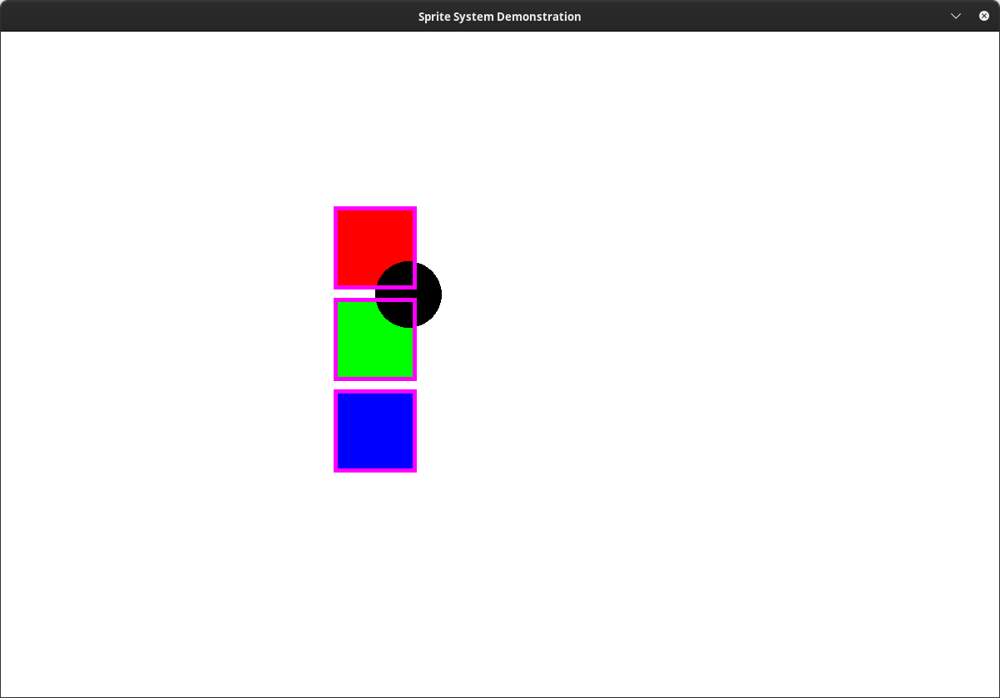

# Contributing

This file will be filled in with all of our standards ect when we can be bothered.a
Until then this is basiocally a dumping ground for design docs :P

NOTE:
Add information on:

- Gamemanager
- Scenes
- Sprites + spritemanager
- Locations, blocks and chunks
- File strucure and root files
- Our modules
- Stuff in utils
- Styling conventions
- Anything else we deem useful
- Profiling + how to use it
- Inheritance trees (entities, particles, ect.)
- File formats (.structure, distribution.structure)

## World data design doc

Location:
(coords) -> Location -> Blocks
Chunks:
(chunk coords) -> Chunk -> Block data
Block Data:
(in-chunk coords) -> Reference to location (-> Blocks)
Block:
Block data - no references

To update:
Loop through every location, then through every block, then update the block
Loop through every chunk, then generate a surface that contains every location's blitted texture
-> Also generate a surface that contains every chunk if debug was activated (this surface would only have the debug information, not the block information. You would blit both textures)
To Draw (or debug):
Loop through every chunk and draw it
-> If debug, draw normally, then draw the debug surf above it.

Only chunks are sprites, and are the only ones called by the spritemanager.

## Licensing

As of version 0.2.1, 2DMC is licensed using the GNU General Public License v3. To comply with the license, all source files (ie. any code file within src/) contain the following header:

```Plaintext
2DMC is a passion project to recreate the game "Minecraft" (all credit to Mojang Studios) in 2D.
Copyright (C) 2022 Doubleface
You can view the terms of the GPL License in LICENSE.md

The majority of the game assets are properties of Mojang Studios,
you can view their TOS here: https://account.mojang.com/documents/minecraft_eula
```

The [main.py file](main.py) contains a slightly longer header which we have omitted for brevity.
You can view a full copy of the license in [LICENSE](LICENSE) OR [here](https://www.gnu.org/licenses/gpl-3.0.en.html)

## Sprites + Spritemanager

### Reasoning

In older versions of 2dmc we had a master list for every type of drawable "sprite" (particles, chunks, ect)
When we wanted to draw, we would some code similar to the following:

```python
for sprite in a_list_of_sprites:
    sprite.draw()
```

One issue we encountered whilst developing with this system was that we often needed sprites of the same kind to be drawn above / behind each other.
This isnt easily doable with the previous system, which led to a lot of janky code with singlular sprites being assigned to variables and lots of weird if checks and it was basically a massive mess.
We also had the issue where if we wanted to reorder the way sprites were drawn we would have tomanually go through and change the position of every related draw call.
No good.

So whilst developing v0.2.1 decided a new system was in order: the sprite system.

### Sprites

We have a sprite superclass that all sprites inherit from. This provides a common interface for conventional methods like `draw()`, `update()`, `debug()` and `kill()` and conventional attributes like `._layer`, `._debug_layer` and `.manager`
Every sprite class takes 2* mandatory argument, a manager (GameManager) and a layer (type: LayersEnum or int). It also takes one optional argument, debug_layer (same type)
If either the layer or the debug_layer is of type `LayerEnum` it will be converted to an `int` on initialisation.
Upon initalisation, the sprite will be added to a spritemanager.

\* The manager argument was added during the development of 0.3.0

The aforementioned LayersEnum is a python enum (`enum.Enum`) in which every argument is automatic (`enum.auto()`)
It represents the order in which sprites will be drawn. It means the orders can be redordered incredibly easy, and adding new orders is similarly very simple.

Every sprite that was given a layer in `__init__` will be drawn in the same layer, along with every other sprite given the same layer.
Layers and their corresponding sprites are drawn in the order of appearance in the LayersEnum enum.

A brief overview of all Sprite methods:

- `__init__(self, manager: GameManager, layer: int | LayersEnum, debug_layer: int | LayersEnum | None = None) -> None`
  - Initialise the sprite
- `draw(self) -> None`
  - Draw the sprite to the screen
- `update(self) -> None`
  - Update or change any class attributes, and handle class logic
- `debug(self) -> None`
  - Draw any debug information related to the sprite to the screen
- `kill(self) -> None`
  - Kill the sprite and handle any cleanup logic

\* Before the development of 0.3.0, the signitaures looked something more like:

- `__init__(self, layer: int | LayersEnum, debug_layer: int | LayersEnum | None = None) -> None`
- `draw(self, screen: pygame.Surface, **kwargs: dict[typing.Any]) -> None`
- `update(self, dt: float, **kwargs: dict[typing.Any]) -> None`
- `debug(self, screen: pygame.Surface, **kwargs: dict[typing.Any]) -> None`
- `kill(self) -> None`

To implement your own sprite, simply create a class that inherits from `Sprite` (v0.3.0+).
Make sure to call `super().__init__(manager, LayersEnum.THE_LAYER_YOU_WANT)`
Then just override any applicable methods to customise the behaviour of your new sprite.
Your sprite can also be killed with `sprite.kill()`
And you can also add the manager with `self.manager`, meaning you have access to pretty much every attribute in 2DMC. Neat!

### Layers Enum

The layers enum is what defines the order and number of onscreen layers.
It is defined like so:

```python
class LayersEnum(enum.Enum):
    ONE = enum.auto()
    TWO = enum.auto()
    ...
    SEVEN_BILLION_FOUR_HUNDRED_AND_TWENTY-FIVE_MILLION_ONE_HUNDRED_AND_THIRTY-TWO_THOUSAND_FIVE_HUNDRED_AND_ONE = enum.auto()
```

The beauty of this is that adding a new layer is as simple as choosing a name and adding it in!

It also makes it really easy to re-arange the ordering of layers (tip: use Alt ↑ / Alt ↓ in VSCode!)

### Spritemanager

This system doesnt work on its own, however.
The other half of the equation is the spritemanager class.

When initialised, spritemanager takes a manager (`GameManager`) and `*args` (`tuple[Sprite]`)
If any args are passed in they will be fed to `SpriteManager.add()`
A dictionary to hold layers is also created.

An explanation of SpriteManager's methods:

- `__iter__(self)` and `__next__`
  
    Makes SpriteManager an iterator so it can be... iterated over?
    The code and details of these functions are beyond the scope of this document (because the code is disgusting and unreadable)
    If, for some reason, you want to understand, modify or utilise this code in greater deal then you can find it [here](src/management/sprite.py)

- `__contains__(self, sprite: Sprite) -> bool`
  
    Adds support for python's `in` operator.
    It will check if the sprite is in its layer. I dont really know why it wouldnt be but its here... just in case.
    It will raise a SpriteNotFoundException if the sprite was not in it's layer.
    It will **print** a LayerNotFoundException if the sprite's layer was not in the spritemanager's layer dict.

- `add(self, *args: tuple[Sprite])`
  
    This method takes any number of sprites as an argument.
    It will add all these sprites to its layers dict, creating layers and debug layers as needed.
    See [Debug Layers](#debug-layers) for more information.
  
    It will raise a NoLayerAttributeException if the sprite does not have a ._layer attribute.

- `remove(self, sprite: Sprite)`
  
    This removes a sprite from its layer (+ debug layer if applicable)
    It will also delete the layer / debug layer if it is empty. This prevents a crash involving empty dicts.
    It will raise a SpriteNotFoundException if the sprite was not in it's layer.
    It will raise a LayerNotFoundException if the sprite's layer was not in the spritemanager's layer dict.

- `draw(self)`
  
    This function serves as both draw() and debug().
    We loop through every layer and every sprite.
    Then if the layer is not a debug layer we draw it.
    We also check if debug is active, if it is we check if the layer is a debug layer or if the sprite's debug layer is the same as its regular layer, in which case we will call `sprite.debug()`. For an explanation on why this is, see [Debug Layers](#debug-layers).

- `update(self)`
  
    We just loop through every sprite and update it, no trickery here :)

### Debug Layers

This is a feature I (Trevor) implemented because I thought having it not implemented would break the spirit and the point of the system. I now realise that we will likely never use this feature. It took a long time to write..

..oh well...

A debug layer is a layer whose name ends in `_DEBUG`.
If you pass `LayersEnum.NAME_DEBUG` or its value (`int`) into a sprite's `debug_layer: int | LayersEnum`, whenever debug is active, that sprite's debug information will be drawn on that layer.
If a sprite's `debug_layer` is not set then it's debug information will be drawn on its normal `layer`.
This makes the system (by my metrics) *entirely* customisable, which in my opinion is sort of worth it.
(even if we never use it :P)

### Demonstration

You can view the source code for this demonstration [here.](dev/rescources/sprite-system-demo/)

I will make this demonstration from scratch in pygame to better explain how this suite of tools works. It will be written using the 0.2.1 sprite system. The system has changed slightly in 0.3.0, however this update and rewrite is not yet finished, so I will use the old system for the demo whilst we smooth out the new version. I will try to remember to update this section when 0.3.0 is released; if I havent then make a Github issue and I'll fix it :) 

I'll start by writing the demo the old way we used to do it, to demonstrate the advantadges of the sprite system, then rewrite them to fit with the new standard and hopefully better explain how to implement your own Sprite classes in the process.

Assume the following file structure:

```tree
demo/
├── main.py
├── README.py
├── lib/
│   └── sprite.py
└── images/
    └── [...]
```

`sprite.py` contains the same content as [the 2DMC sprite system file,](src/management/sprite.py) minus the LayersEnum which we will go over in more detail in just one second.


We'll start in main.py with some boilerplate which I'm sure you have seen many times before so I won't bother explaining it :P

```python
from pygame.math import Vector2 as VEC
import pygame

from pygame.locals import * # Dont do this normally! I'm only doing this for demonstration!

WIDTH, HEIGHT = SCR_DIM = (1200, 800)
SPEED = 500
FPS = 80

pygame.init()
screen = pygame.display.set_mode(SCR_DIM)
pygame.display.set_caption("Sprite System Demonstration")
clock = pygame.time.Clock()

running = True
while running:
    screen.fill((255, 255, 255))
    for event in pygame.event.get():
        if event.type == pygame.QUIT:
            running = False

    pygame.display.flip()
    clock.tick(FPS)

pygame.quit()
```

Next we'll write a quick player class:

```python
class Player:
    def __init__(self, pos: VEC | tuple[int, int]) -> None:
        self.size = VEC(80, 80)
        self.pos = VEC(pos)
        self.vel = VEC(0, 0)

    def update(self, dt: float) -> None:
        keys = pygame.key.get_pressed()
        self.vel = VEC(0, 0)

        if keys[K_a]:
            self.vel.x -= SPEED
        if keys[K_d]:
            self.vel.x += SPEED
        if keys[K_w]:
            self.vel.y -= SPEED
        if keys[K_s]:
            self.vel.y += SPEED

        self.pos += self.vel * dt

    def draw(self, screen: pygame.Surface) -> None:
        pygame.draw.circle(screen, (0, 0, 0), self.pos - (self.size / 2), self.size.x / 2)
```

..and a square class:

```python
class Square:
    instances = []

    def __init__(self, pos: tuple[int, int] | VEC, colour: tuple[int, int, int]):
        self.__class__.instances.append(self)

        self.size = VEC(100, 100)
        self.pos = VEC(pos)

        self.colour = colour

    def update(self) -> None:
        pass # While I could omit update() for this example, you rarely can in practise so I'll leave it here.

    def draw(self, screen: pygame.Surface) -> None:
        pygame.draw.rect(screen, self.colour, pygame.Rect(*self.pos, *self.size))
```

Cool! We can create them like so:

```python
player = Player((200, 200))
for i, colour in enumerate(((255, 0, 0), (0, 255, 0), (0, 0, 255))):
    Square((400, 200 + i * 50), colour)
```

..then update and draw them in the main `while` loop:

```python
for square in Square.instances:
    square.update()

player.update(dt)

for square in Square.instances:
    square.draw(screen) # Whilst we could merge these 2 loops for this demo you rarely can in practise so I wont here.

player.draw(screen)
```

If we run the code now we should see it working as expected:



We can see that the player draws above the sqaures and the squares draw in the order that we declared them.

However, what if we decide that we instead want the green square to draw above the others?

Lets try and implement this:

We will now have to initialise the squares like so:

```python
s_r = Square((400, 200), (255, 0, 0))
s_g = Square((400, 250), (0, 255, 0))
s_b = Square((400, 300), (0, 0, 255))
```

Then draw them like this:

```python
for square in Square.instances:
    if square is not s_g:
        square.draw(screen)
s_g.draw(screen)
```



As you can see, we got the expected result. However:


1) The code is messy and hard to follow

2) The more rules we add (say, the player gets drawn above green), the worse this will become

3) Re-ordering the way sprites are drawn is gets increasingly complex and difficult the more sprites there are and the more sprites there are with seperate rules

4) Its difficult to make define where 1 instance of a class will be drawn relative to other instances of the class

5) Creating and drawing lots of classes and their instances will end up in long, repeated calls to `x.draw(screen)`, `y.draw(screen)`, `z.draw(screen)`, ect


Let's rewrite this using the Sprite system!

First, lets populate LayersEnum:

```python
class LayersEnum(Enum):
    SQUARE = auto()
    PLAYER = auto()
```

Next, lets make Player and Square officially Sprites:

```python
class Player(Sprite):
    def __init__(self, pos: VEC | tuple[int, int]) -> None:
        super().__init__(LayersEnum.PLAYER)
        ...
```

```python
class Square(Sprite):
    def __init__(self, layer: LayersEnum | int, pos: tuple[int, int] | VEC, colour: tuple[int, int, int]):
        super().__init__(layer)
        ...

    def update(self, dt) -> None:
        pass # While I could omit update() for this example, you rarely can in practise so I'll leave it here.
```

..that's all that you need to change! Just make the class inherit from Sprite and call `super().__init__(layer)` in your class's constructor. 

A few things to note:

- Because we always know that `Player` will draw on the PLAYER layer, we don't need to pass `layer` into `__init__`, we can just pass it through directly.
  
  - However, because we might change what layer a `Square` draws on we do need to pass a layer argument in.

-  In `Square.update` we need to pass in `dt` to satisfy the `Sprite.update` function signature. This is a limit with the way the 0.2.1 sprite system works that is mitigated in 0.3.0 with the Scene, GameManager and `self.game` architecture (there will likely be a section on this in this document, whenever one of us gets around to writing it :P)

- Finally, we use the `LayersEnum | int` type annotation to refer to a layer argument. This is because `Sprite.__init__` can recieve and parse either a LayersEnum or an int. If you want to understand this in greater depth you can check out the Sprite baseclass.

Then we can initialise our Squares and Player:

```python
Player((200, 200))
Square(LayersEnum.SQUARE, (400, 200), (255, 0, 0))
Square(LayersEnum.SQUARE, (400, 250), (0, 255, 0))
Square(LayersEnum.SQUARE, (400, 300), (0, 0, 255))
```

This will automagically add the sprites to the SpriteManager.

Finally, we can draw and update the sprites in the main loop:

```python
SPRITE_MANAGER.update(dt)
SPRITE_MANAGER.draw(screen, False)
```

This works as expected.


Now lets implement the green square displaying above the others:

Its as simple as:

1) Adding a new entry in LayersEnum:
   
   ```python
   ```python
   class LayersEnum(Enum):
       SQUARE = auto()
       GREEN_SQUARE = auto()
       PLAYER = auto()
   ```
   ```

2) Updating the sprite creation call:
   
   ```python
   Square(LayersEnum.SQUARE, (400, 200), (255, 0, 0))
   Square(LayersEnum.GREEN_SQUARE, (400, 250), (0, 255, 0))
   Square(LayersEnum.SQUARE, (400, 300), (0, 0, 255))
   ```

And thats it! 


The result is exactly the same as it was before (emphasis on *exactly* because I'm using the same images as earlier but it does actually work xD), but this time more maintainable, scaleable and readable.


The final part of this demonstration is to display Debug Layers.

Lets start by adding a simple debug toggle and passing it into `SpriteManager.draw`:


```python
debug = False
running = True
while running:
    screen.fill((255, 255, 255))
    dt = clock.tick_busy_loop(FPS) / 1000

    for event in pygame.event.get():
        if event.type == pygame.QUIT:
            running = False
        if event.type == KEYDOWN:
            if event.key == K_F1:
                debug = not debug

    SPRITE_MANAGER.update(dt)
    SPRITE_MANAGER.draw(screen, debug)
    ...
```

Then lets give `Square` a simple debug function. We'll make it display their outline in.. purple. I'm also going to seperate out the squares to make it a little easier to understand.

```python
>> Square
def debug(self, screen: pygame.Surface) -> None:
    pygame.draw.rect(screen, (255, 0, 255), pygame.Rect(*self.pos, *self.size), width=5)

>> Global
Square(LayersEnum.SQUARE, (400, 210), (255, 0, 0))
Square(LayersEnum.GREEN_SQUARE, (400, 320), (0, 255, 0))
Square(LayersEnum.SQUARE, (400, 430), (0, 0, 255))
```

If we run this and enable debug, we see:



Perfect! We can see the sprites' debug information is drawn above the sprite, but below any other sprite. However, lets say we want to have the square's debug information draw above the player. This is the purpose of debug layers.

First, add some new entries to the LayersEnum:

```python
class LayersEnum(Enum):
    SQUARE = auto()
    GREEN_SQUARE = auto()
    PLAYER = auto()
    SQUARE_DEBUG = auto()
    GREEN_SQUARE_DEBUG = auto()
```

**IMPORTANT: A debug layer must end with "_DEBUG"!**


Next, let's modify `Square.__init__`:

```python
def __init__(self, layer: LayersEnum | int, debug_layer: LayersEnum | int, pos: tuple[int, int] | VEC, colour: tuple[int, int, int]):
    super().__init__(layer, debug_layer)
```

And finally edit the square instantiation:

```python
Square(LayersEnum.SQUARE, LayersEnum.SQUARE_DEBUG, (400, 210), (255, 0, 0))
Square(LayersEnum.GREEN_SQUARE, LayersEnum.GREEN_SQUARE_DEBUG, (400, 320), (0, 255, 0))
Square(LayersEnum.SQUARE, LayersEnum.SQUARE_DEBUG, (400, 430), (0, 0, 255))
```

Then when we run it:



Perfect! The debug information is being drawn above the player. 


Hopefully this demonstration has served as a guide on creating you own sprites, a better understanding of layers and a visual explanation of debug layers!

### Exceptions

There are a few exceptions to make working with errors in this system easier.
They all implement from Exception.
The text following "Takes:" are the arguments to `__init__`.
The text following "Prints:" is whats returned from `__str__` (in pseudocode)
They are as follows:

- `NoLayerAttributeException`
    Takes: `Sprite`
    Prints: "Class `self.sprite.__class__` does not have a \_layer / \_debug_layer attribute!"

- `LayerNotFoundException`
    Takes: `int | Sprite`
  
        -> (if a sprite is given it's `_layer` attribute will be used)
  
    Prints: "Layer `LayersEnum(int | Sprite._layer).name` does not exist in the layer list!"

- `SpriteNotFoundException`
    Takes: `Sprite`
    Prints: "Sprite object `Sprite` does not exist in the sprite list!"
